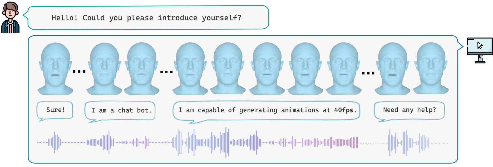

<div align="center">
  <h1> ✨StreamingTalker: Audio-driven 3D Facial Animation with Autoregressive Diffusion Model</h1>
</div>

<div align="center">
  <a href="https://github.com/yangyifan18">Yifan Yang</a> &bull;
  <a href="https://anitacen.github.io/">Zhi Cen</a> &bull;
  <a href="https://pengsida.net/">Sida Peng</a> &bull;
  <a >Xiangwei Chen</a> &bull;
  <a >Yifu Deng</a> &bull;
  <a >Xinyu Zhu</a> &bull;
  <a >Fan Jia</a> &bull;
  <a href="https://www.xzhou.me/">Xiaowei Zhou</a> &bull;
  <a href="https://person.zju.edu.cn/0093140">Hujun Bao</a>

  ### [Project Page](https://zju3dv.github.io/StreamingTalker) | [Paper](https://arxiv.org/pdf/2511.14223) | [Demo](https://www.youtube.com/watch?v=7Nnh-iwVRlA&t=3s)

  ### AAAI 2026 Oral
</div>

<div align="center">



</div>


## 📝 Preparation

### Environment
- Linux
- Python 3.10+
- Pytorch 2.4.0
- CUDA 12.1 (GPU with at least 12GB DRAM)

```
conda create -n streamingtalker python=3.10
conda activate streamingtalker
# Use pip to install core pakages:
pip install -r requirements.txt
```

### Model Weights
(optional)  
Download pretrained VQ-VAE and StreamingTalker model weights from modelscope:

```
modelscope download --model youtopia/StreamingTalker --local_dir ./checkpoints
```

### Dataset
There are 2 options to prepare datasets:
#### Option 1:
You can directly download our preprocessed datasets from modelscope:
```
modelscope download --dataset youtopia/vocaset ./data/vocaset
modelscope download --dataset youtopia/biwi ./data/biwi
```

#### Option 2:
or you can follow the below steps to download and process original datasets.

#### VOCASET
Request the VOCASET data from [https://voca.is.tue.mpg.de/](https://voca.is.tue.mpg.de/). Place the downloaded files `data_verts.npy`, `raw_audio_fixed.pkl`, `templates.pkl` and `subj_seq_to_idx.pkl` in the folder `vocaset/`. Download "FLAME_sample.ply" from [voca](https://github.com/TimoBolkart/voca/tree/master/template) and put it in `data/vocaset/`. Read the vertices/audio data and convert them to .npy/.wav files stored in `data/vocaset/vertices_npy` and `data/vocaset/wav`:
```
cd vocaset
python process_voca_data.py
```

#### BIWI

Follow the [`datasets/biwi/README.md`](datasets/biwi/README.md) to preprocess BIWI dataset and put .npy/.wav files into `biwi/vertices_npy` and `biwi/wav`, and the `templates.pkl` into `data/biwi/`.

After above steps, your folder should look like this:
```
.
├── algorithms/
└── chatdemo/
└── checkpoints/
│   ├── diffar_biwi_241212.ckpt
│   ├── biwi_vae.ckpt
|   ├── diffar_voca_241120.ckpt
|   ├── voca_vae.ckpt
└── data/
|   └──vocaset
|   |   ├──vertices_npy
|   |   ├──wav
|   |   ├──templates
|   |   ├──templates.pkl
|   |   ├──FLAME_masks.pkl
|   └──biwi
|   |   ├──vertices_npy
|   |   ├──wav
|   |   ├──templates
|   |   ├──templates.pkl
|   |   ├──regions
└── ...
```

## 🚀 Training
The training process contain 2 stages:

First, train a VQ-VAE.
```
# train on biwi
scripts/biwi/train_stage1.sh
# train on vocaset
scripts/vocaset/train_stage1.sh
```

Then train the AR transformer and diffusion head with frozen VQ-VAE.
```
# train on biwi
scripts/biwi/train_stage2.sh
# train on vocaset
scripts/vocaset/train_stage2.sh
```
#### Key params:
- --cfg: config file used (defined in configs folder)
- --exp: name of experiment 

## 📊 Evaluation
After training, you can test our model by running following scripts:
```
# test on vocaset
scripts/vocaset/eval_vocaset.sh
# test on biwi
scripts/biwi/eval_biwi.sh
```

CAUTION: Since the evaluation needs to run once for each training-set identity and then average the results, the evaluation stage may take a considerable amount of time. You can also change the `REPLICATION_TIME` in config file to get more average evaluation results.

## 👓 Visualization
You can change the 'example' and 'id' to try different audio and speaker identity.

- to animate a mesh in FLAME topology, run:
```
# example
python visualize.py \
    --cfg configs/vocaset/stage2_tsm2.yaml \
    --template ./data/vocaset/templates.pkl \
    --example ./data/vocaset/wav/FaceTalk_170809_00138_TA_sentence06.wav \
    --ply ./data/vocaset/templates/FLAME_sample.ply \
    --checkpoint ./checkpoints/diffar_voca_241120.ckpt \
    --id FaceTalk_170809_00138_TA \
    --split val
```

- to animate a mesh in BIWI topology, run:
```
# example
python visualize.py \
    --cfg configs/biwi/stage2_diffar.yaml \
    --exp diff_ar_biwi_visualize \
    --template ./data/biwi/templates.pkl \
    --example ./data/biwi/wav/F4_e36.wav \
    --ply ./data/biwi/templates/BIWI.ply \
    --checkpoint ./checkpoints/diffar_biwi_241212.ckpt \
    --id F4 \
    --split val
```

#### Key params:
- --cfg: config file used (defined in configs folder)
- --example: audio file used
- --checkpoint: path of pretrained checkpoint
- --id: test identity
- --split: whether test the performance of trainset or not

## 🖥️ Demo
If you want to try our real time demo, please prepare two computers (server & client).

The server must be equipped with a GPU more powerful than an RTX 4090 and with more than 12 GB of VRAM. Run the following command to start the server; it will then wait for the client's input.
```
python livestream_demo.py
```
Meanwhile, you'll need a microphone to input audios or you can simply use your laptop as client to transfer audio to server. Please run the following command to start client. You may need to change the `SERVER_IP` and `SERVER_PORT` based on the network setting of your server.
```
python chatdemo/speech_input.py
```

## ✉️ Citation
If you find StreamingTalker useful in your research, please consider citing our paper:
```
@article{yang2025streamingtalker,
  title={StreamingTalker: Audio-driven 3D Facial Animation with Autoregressive Diffusion Model},
  author={Yang, Yifan and Cen, Zhi and Peng, Sida and Chen, Xiangwei and Deng, Yifu and Zhu, Xinyu and Jia, Fan and Zhou, Xiaowei and Bao, Hujun},
  journal={arXiv preprint arXiv:2511.14223},
  year={2025}
}
``` 

## 🙏 Acknowledgement
Our implementation is based on several open-source repositories. Thank to these authors for their beautiful code!
- [Ready-to-React](https://github.com/zju3dv/ready_to_react)
- [DiffSpeaker](https://github.com/theEricMa/DiffSpeaker)
- [CodeTalker](https://github.com/Doubiiu/CodeTalker)
- [FaceFormer](https://github.com/EvelynFan/FaceFormer)
- [DiffPoseTalk](https://github.com/DiffPoseTalk/DiffPoseTalk)